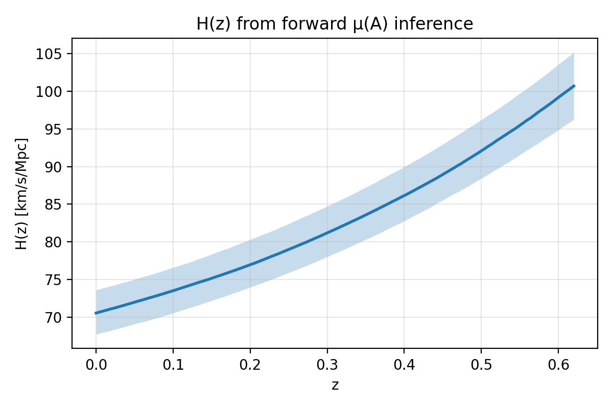
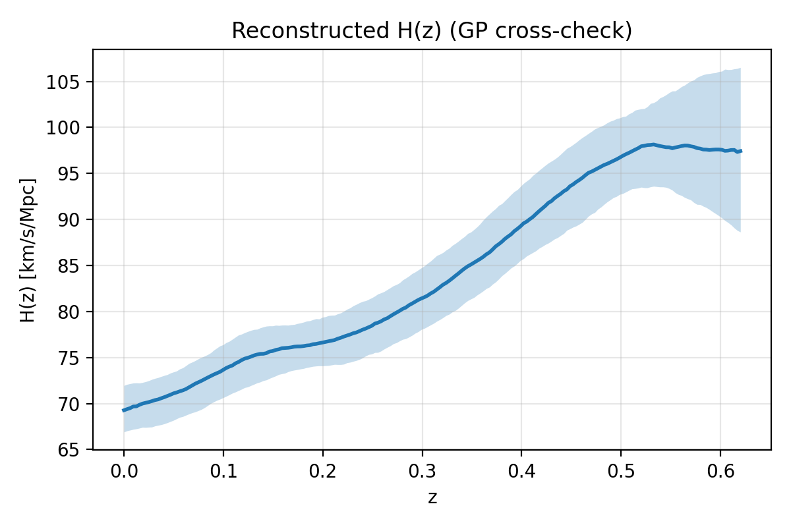
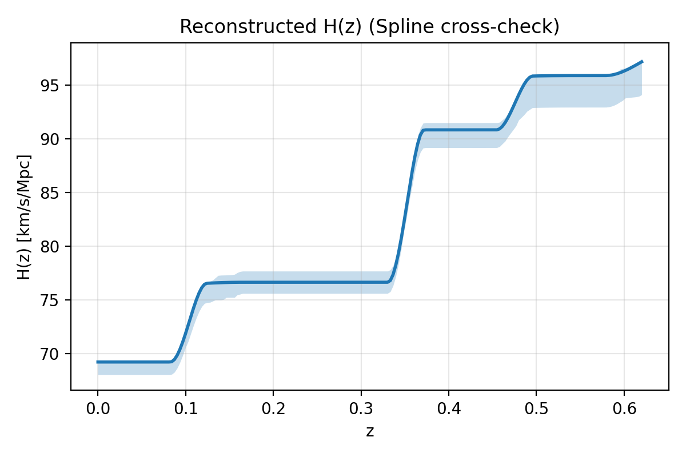
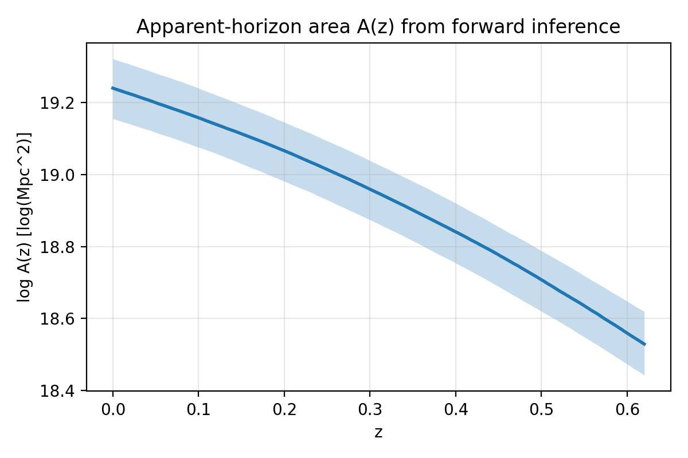
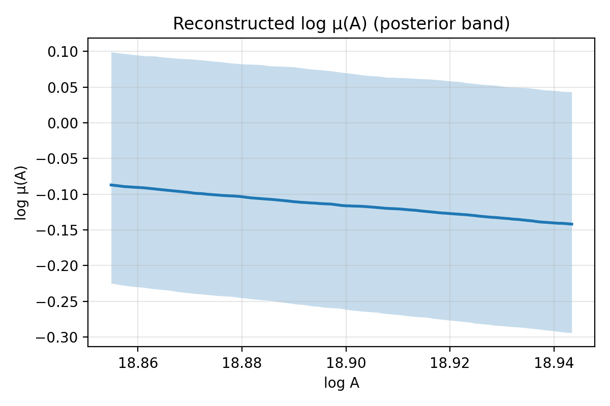

# Nonparametric reconstruction of the horizon entropy slope μ(A)

_git: 2805e482e85ff2c3cf5c18cc9acedf4e856fc060 (dirty=True)_

_command: `scripts/run_realdata_recon.py --out outputs/finalization/highpower_multistart_v2/M0_start404 --seed 404 --mu-init-seed 404 --mu-sampler ptemcee --rsd-mode dr12+dr16_fsbao --include-lensing --cpu-cores 0 --mu-procs 0 --gp-procs 0 --save-chain outputs/finalization/highpower_multistart_v2/M0_start404/samples/mu_chain.npz --mu-steps 3000 --mu-burn 1000 --mu-draws 1600`_

_mapping_variant: M0_

## Lay summary

We reconstruct how a putative *horizon entropy law* would need to vary with horizon area to be consistent with late-time expansion data, *given* a specific horizon-thermodynamics mapping. The reconstruction is nonparametric: we do not assume Tsallis/Barrow/Kaniadakis forms a priori; those are tested only after reconstruction.

## Data

Selected domain: z ∈ [0.02, 0.62] (automatic SN density rule)

| Dataset                                  | N    | z-range        | Covariance             |
| ---------------------------------------- | ---- | -------------- | ---------------------- |
| Pantheon+ (cosmology subset)             | 1322 | [0.020, 0.620] | full cov (input)       |
| Pantheon+ (binned for forward inference) | 12   | [0.037, 0.593] | binned (from full cov) |
| Cosmic chronometers (BC03_all)           | 9    | [0.090, 0.593] | diag + jitter          |
| FSBAO sdss_dr12_consensus_fs             | 9    | [0.380, 0.610] | full cov               |
| FSBAO sdss_dr16_lrg_fsbao_dmdhfs8        | 6    | [0.380, 0.510] | full cov               |
| Planck CMB lensing proxy                 | 1    | -              | Gaussian (compressed)  |
| desi_2024_bao_all                        | 3    | [0.295, 0.510] | full cov               |

## Method

### Thermodynamic mapping
We use an apparent-horizon Clausius relation (Cai–Kim style) and reconstruct the *entropy-slope modification* μ(A) ≡ (dS/dA)_BH / (dS/dA). Assuming that (ρ+p) is matter-dominated at late times, the mapping implies:

$$\frac{dH^2}{dz} = 3 H_0^2 \Omega_{m0} (1+z)^2\,\mu(A),\qquad A(z)=4\pi\left(\frac{c}{H(z)}\right)^2.$$

Standard GR with Bekenstein–Hawking entropy corresponds to μ(A)=1.

Critically, we *do not* infer μ(A) by differentiating a noisy reconstruction of H(z). Instead, we treat μ(A) as a latent function and solve this equation forward as an ODE for H(z), propagating posterior uncertainty through to observables.

### Forward-model inference of μ(A)
- We parameterize log μ(x) with a natural cubic spline in x ≡ log(A/A0), with μ>0 enforced by exponentiation.
- Priors: a weak Gaussian amplitude prior on spline knot values around log μ=0, and a smoothness prior on second differences with a log-uniform hyperprior on the curvature scale.
- Likelihood: SN (binned using the full covariance), cosmic chronometers, and BAO. Optional external constraints can be enabled for growth (fσ8) and CMB lensing (compressed proxy).
- We include additive jitter terms σ_cc,jit and σ_sn,jit to absorb mild unmodeled dispersion.

FSBAO enabled (`--rsd-mode dr12+dr16_fsbao`): using correlated distance+fσ8 vectors; dropped overlapping BAO-only datasets: ['sdss_dr12_consensus_bao', 'sdss_dr16_lrg_bao_dmdh'].

Planck lensing proxy enabled: Gaussian constraint on σ8 Ωm0^0.25.

### H(z) cross-check reconstructions
- GP reconstruction of log H(z) at spline knots (hyperparameters marginalized).
- Penalized spline reconstruction with bootstrap.
These are used only as method cross-checks; μ(A) inference is done via the forward model above.

## Results

## Mapping sensitivity

Not run. Re-run with `--run-mapping-variants` to quantify mapping sensitivity.

## Proximity tests (post hoc)

Distances are computed in function space as a weighted L2 distance in logA, with weights ∝ 1/Var[log μ]. Bayes factors here are *approximate* and computed against a GP baseline in (logA, logμ) using Gaussian pseudo-data.

| Model      | δ     | Δ / β̃   | D² (mean) | ΔlogZ vs GP |
| ---------- | ----- | -------- | --------- | ----------- |
| BH (μ=1)   | -     | -        | 0.00975   | -19.06      |
| Tsallis    | 1.670 | -        | 1.24e-11  | -3.26       |
| Barrow     | -     | 1.339    | 1.24e-11  | -3.24       |
| Kaniadakis | -     | β̃=0.921 | 9.55e-08  | -3.28       |

## Diagnostics

- Forward inference acceptance fraction (mean): 0.307
- H0 [km/s/Mpc] (16/50/84): [67.69, 70.54, 73.60]
- Ωm0 (16/50/84): [0.297, 0.353, 0.384]
- r_d [Mpc] (16/50/84): [138.16, 143.99, 149.82]
- σ8,0 (16/50/84): [0.743, 0.773, 0.810]
- S8 (16/50/84): [0.790, 0.828, 0.859]
- σ_cc,jit [km/s/Mpc] (16/50/84): [0.906, 2.8, 6.04]
- σ_sn,jit [mag] (16/50/84): [0.0254, 0.0335, 0.0437]
- GP baseline evidence kernel: matern32 (amp=0.0967, ell=0.532)

## Notes and limitations

- The μ(A) inversion uses the late-time matter-dominance approximation for (ρ+p). Results should be interpreted as "the entropy-slope modification required under this mapping".
- Full prior/kernel ablations and synthetic closure tests are available via `scripts/run_ablation_suite.py` and `scripts/run_synthetic_closure.py`.

## Ablations (quick)

| Case            | D² BH  | D² Tsallis | D² Barrow | D² Kaniadakis |
| --------------- | ------ | ---------- | --------- | ------------- |
| sn_diagonal_cov | 0.0171 | 9.86e-10   | 9.86e-10  | 5.38e-08      |